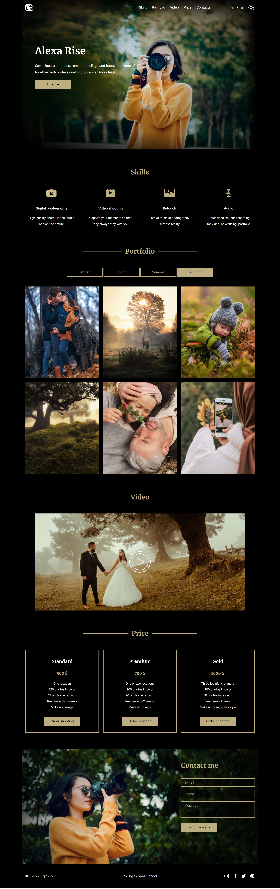

# Portfolio

### [Задание 1](https://github.com/rolling-scopes-school/tasks/blob/master/tasks/portfolio/portfolio-part1.md)
Необходимо сверстать страницу согласно [макету](https://www.figma.com/file/1A1SJ7FYyMUiBqhU3WUiBI/Portfolio) (pixel perfect) - только **Desktop**.

### [Задание 2](https://github.com/rolling-scopes-school/tasks/blob/master/tasks/portfolio/portfolio-part2.md)

В этой части задания адаптируем ранее сверстанную страницу для планшетов и мобильных устройств.
На разрешении 768рх ставится задача совпадения вёрстки с [макетом](https://www.figma.com/file/1A1SJ7FYyMUiBqhU3WUiBI/Portfolio) - **Tablet**.
На остальных разрешениях до 320рх включительно достаточно обеспечить отсутствие горизонтальной полосы прокрутки при сохранении всего контента страницы.
Также на этом этапе добавляем в вёрстку адаптивное меню, для создания которого используем js.

### [Задание 3](https://github.com/rolling-scopes-school/tasks/blob/master/tasks/portfolio/portfolio-part3.md)

В этой части задания необходимо добавить в свёрстанную на предыдущих этапах веб-страницу следующий функционал:

- смена изображений в секции portfolio
- перевод страницы на два языка
- возможность переключения светлой и тёмной темы

## Result

Deploy: https://pavelzabalotny.github.io/rspreschool/portfolio/

Done: 27.01.2022
