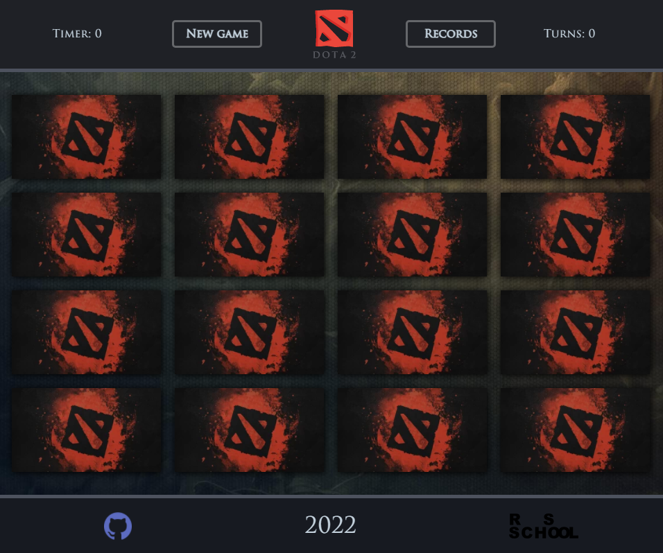

# Memory game

### Описание проекта
Memory-game набор из двенадцати (может быть другое количество) пар одинаковых карточек, которые отображаются "рубашкой" вверх. Кликом по карточке игрок переворачивает её и кликает по следующей карточке. Если на двух карточках изображены одинаковые рисунки, они остаются открытыми, если рисунки разные - карточки переворачиваются "рубашками" вверх. Цель игры - открыть все карточки за наименьшее число ходов.

### Задача
Вам необходимо создать приложение memory-game.

## Result:
1. [Task](https://github.com/rolling-scopes-school/tasks/blob/master/tasks/js30%23/js30-8.md)
2. Screenshot:

3. [Deploy](https://pavelzabalotny.github.io/rspreschool/dota-2-memory-game/)
4. Done: 21.02.2022
